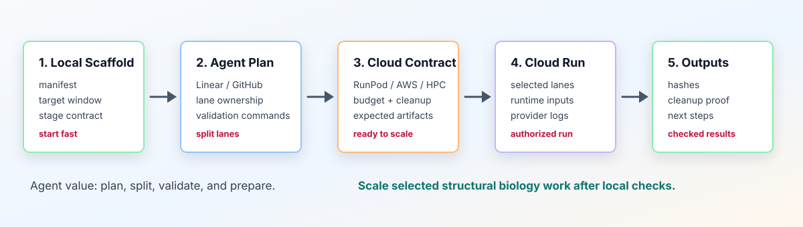

# Workflow Map

Structure Factory turns a public or synthetic structural biology request into a reviewable campaign record that you and your chosen AI agent can continue. It records the target and site, lanes, tool choices, execution routes, stage ledgers, expected artifacts, result boundaries, and release checks.

Tell the agent to use the BioSymphony Structure Factory skill at `skills/biosymphony-structure-factory/SKILL.md`. The agent can inspect examples, create missing integration files, and coordinate local or remote work within the choices you record.

Public closeouts use `planning`, `public_demo`, `public_synthetic_demo`, `computational_candidate`, `insufficient_support`, or `blocked`.



Text equivalent: local scaffold leads to a task pack, then a cloud contract, an ignored runtime packet, explicit human authorization, execution, and verified closeout.

## Give Your Agent A Complete Brief

Record these decisions before planning:

1. **Target and site:** a public PDB, EMDB, or UniProt accession, or a synthetic fixture; target chain or chains; and a bounded residue window or site-selection rule.
2. **Goal and lanes:** the campaign goal and required design, fold or cofold, score, render, and screen lanes.
3. **Comparison method:** an exact source-tool replay, workflow-shape replay, deliberate tool swap, replay-and-swap comparison, or no comparison. A workflow-shape replay keeps the published stages without asserting source tool identities.
4. **Stage routes:** local, a user-supplied platform skill, a hosted API client, FAL, Modal, RunPod, Lambda Cloud, AWS, neocloud, SSH/HPC, or a mixed route.
5. **Run limits:** budget, runtime cap, round and candidate counts, primary metric, and stopping rule.
6. **Closeout:** expected output paths and counts, hashes, local or provider receipts, failure-row handling, cleanup evidence, and figures or renders when the campaign needs visual review.

The agent validates this brief, materializes the campaign files, and dry-runs selected local adapters or clients. A record marked `adapter_required` needs a validated adapter registry below `.runtime/`; a platform skill writes the same declared outputs and closes them with the same contract. A successful dry run records adapter or client readiness.

## What You Get

| Starting Point | Useful Output | First Gate |
| --- | --- | --- |
| Public PDB/EMDB/UniProt accession | Target/data contract, result boundaries, expected artifacts | `bsf validate` |
| Binder-design idea | Target-window file, generation lanes, cofold/model-comparison plan | `bsf audit .` |
| GPCR or multimer-state idea | Receptor/state wave plan, structure lanes, prediction/render contracts | `make issue-dry-run-check` |
| Existing public structure | PDB/EMDB structure-mapping outline, provenance plan, review notes | `make release-check` |
| Raw cryo-EM processing request | CryoCore handoff contract, human authorization gates, expected downstream artifacts | `bsf audit .` |
| Screening or active-learning plan | Fixture run, fanout estimate, shard/result schemas | recipe-specific checks |
| Remote GPU need | Tracked provider template, ignored runtime packet, and budget, cleanup, and authorization gates | `make runpod-public-template-check` |
| Agent work program | Tracker-neutral issues for Linear, GitHub Issues, Notion, or another queue | `bsf issue-dry-run` |

## Timeboxed Paths

| Time | Goal | Commands Or Prompt | Result |
| --- | --- | --- | --- |
| 5 minutes | Prove the repo works locally | `bsf validate examples/pd-l1-binder-design-public` and `make harness-check` | Installed CLI and validated public example |
| 30 minutes | Draft a campaign | Record the brief, run `bsf scaffold-campaign .runtime/my-demo ...`, then ask an agent to use the Structure Factory skill | Target/site contract, stage contract, validation notes |
| 60 minutes | Turn it into reviewable work | `bsf issue-dry-run examples/<campaign-id> --out .runtime/<campaign-id>-issues` | Tracker-neutral task drafts with owned paths and validation commands |
| 2 hours | Prepare a selected execution route | Run the matching adapter, provider-template, scope, and contract checks | Checked route contract and ignored runtime packet with explicit gates |
| Later, with approval | Execute a bounded provider or local run | Validated adapter, client, or platform skill with explicit human authorization when required | Artifacts and counts, hashes, receipts, cost/cleanup proof, and bounded closeout |

## Three Operating Modes

### Local-Only

Use this mode for learning, public examples, small fixtures, task drafting, and public-release review.

```bash
bsf scaffold-campaign .runtime/a2a-demo \
  --campaign-id a2a-demo \
  --target-label "A2A receptor" \
  --public-accession "PDB:5G53" \
  --window "TM6 activation microswitch"
bsf validate .runtime/a2a-demo
bsf audit .
```

Local-only work may create `.runtime/` scaffolds and compact reports. It must not commit private data, generated structures, raw datasets, model weights, provider logs, or credentials.

### Tracker-Coordinated

Use this mode when the work is bigger than one prompt and should be split across tasks.

```bash
bsf issue-dry-run examples/pd-l1-binder-design-public \
  --out .runtime/pd-l1-issues
```

Import or adapt the generated Markdown into Linear, GitHub Issues, Notion tasks, or another queue. Keep provider fields, result boundaries, owned paths, dependencies, validation commands, and expected artifacts with each task.

### Execution-Prepared

Use this mode when a campaign needs a local tool, platform skill, hosted API, FAL, Modal, RunPod, Lambda Cloud, AWS, neocloud, SSH/HPC, or a mixed route. Assign one route to each stage so the handoff is reviewable.

Tracked files store reusable contracts:

- provider profile
- stage contract
- budget/runtime expectations
- runtime-secret reference names
- expected artifacts
- input-audit and contract-self-check requirements
- cleanup and partial-output policy

Create live provider packets and bindings under ignored `.runtime/` space. Keep pod IDs, registry auth, accepted-license state, concrete placement, fetched artifacts, and logs out of tracked git files.

## Execution Route Ladder

1. Define the biological contract locally: target, site, source posture, result boundary, expected artifacts, primary metric, and stopping rule.
2. Choose a route for every stage: local, platform skill, hosted API, FAL, Modal, RunPod, Lambda Cloud, AWS, neocloud, SSH/HPC, or a mixed route.
3. Validate the tracked template or adapter record. Add a validated `.runtime/` registry for a user-supplied local program, API client, cloud client, scheduler, or container entry point.
4. Materialize an ignored `.runtime/` packet with concrete bindings, secret-reference names, output declarations, and a cleanup policy.
5. Dry-run the selected adapter or client. For a platform skill, bind its declared output root and closeout contract before the skill runs.
6. Obtain explicit human authorization before a paid start, non-public upload, terms acceptance, or large or license-gated download. The approval names the route, data posture, budget, runtime, and applicable terms.
7. After execution, join each stage receipt to its declared artifacts, counts, hashes, validation notes, cost record, cleanup proof, and figures or renders when selected.
8. Close the task with the supported source posture and result boundary. Label partial or missing outputs accurately.

Copyable provider-preparation commands:

```bash
make runpod-public-template-check
make runpod-scope-check
SMOKE_MANIFEST=runpod/launch-manifests/no-download-smoke.json make launch-preflight
make launch-bundle
```

After an authorized run, validate pulled artifacts from ignored storage with:

```bash
PROVIDER_ARTIFACT_ROOT=.runtime/provider-artifacts/<run-id> make provider-closeout-check
```

RunPod is the reference pod path in this repo. AWS Batch is the reviewed cloud-scale path. Other providers are useful when a user already has capacity, but they need the same input-audit, artifact, cleanup, and closeout gates.

## Linear And Symphony Work Plans

1. Use `bsf issue-dry-run` to create tracker-neutral task drafts.
2. Give every task exact inputs, owned paths, dependencies, risk notes, validation commands, expected artifacts, route, and result boundary.
3. Start each new or cost-bearing wave only after its prerequisite checks pass.
4. Close a provider-backed task after artifact fetch, count and hash validation, receipts, cost record, cleanup proof, and review.

Linear is optional. The same task contract works in GitHub Issues, Notion, or another task system. Symphony and Linear add durable state transitions, dependencies, and parseable worker outcomes.

## Safety Boundary

The public repo should contain:

- accessions, manifests, schemas, templates, small fixtures, bounded reports, and validators
- tracked cloud templates that omit live execution state
- tracker-neutral task packs
- validation notes and result boundaries

The public repo should not contain:

- private paths, private tracker URLs, credentials, tokens, pod IDs, logs, accepted-license state, raw biological data, generated candidate structures, unpublished sequences, model weights, or large provider artifacts

Raw cryo-EM movie intake, EMPIAR subset execution, reconstruction, and map-to-model build execution are CryoCore-owned lanes. Structure Factory can record the public accession, handoff gates, expected downstream artifacts, and later structure-mapping plan.

Run `make public-switch-check` before publishing, sharing, or handing the repo to a fresh agent.
